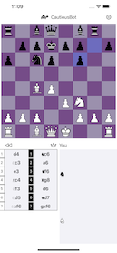
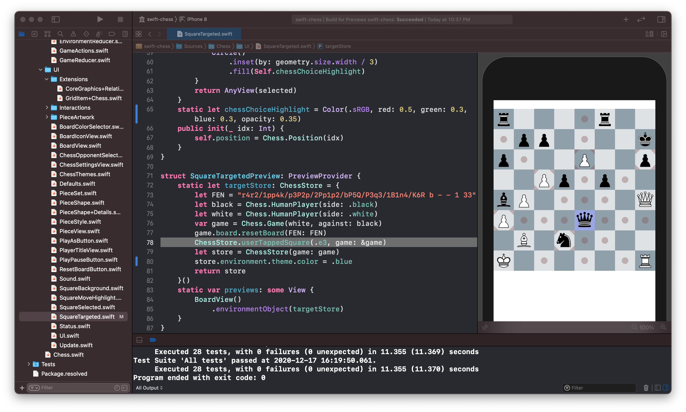

# Chess

This package provides UI components and game logic for standard chess play. The code presents a unified pattern for the game interactions using 
[Combine](https://developer.apple.com/documentation/combine) and [SwiftUI](https://developer.apple.com/documentation/swiftui). 

You can find an example Xcode project in the "PlayChess" folder.
 


This app is also available in the [App Store](https://apps.apple.com/us/app/playchess/id1544715134) if you'd like to try it.

### Getting Started

The main starting place for using `swift-chess` is the [ChessStore](./Sources/Chess/Store/ChessStore.swift)

It houses a chess game, its board, and players. It provides the game and environment interface via a reducer pattern.

Here's an example of creating a ChessStore that would allow two people to play.

```
let white = Chess.HumanPlayer(side: .white)
let black = Chess.HumanPlayer(side: . black)
let game = Chess.Game(white, against: black)
let store = ChessStore(game: game)
```

You might then use the store as the environment variable for a BoardView. 

### Going Further

There is a lot to discover, you will find previews in the code, this can be helpful to get a visual guide. 

Here's XCode showing the preview of `SquareTargeted.swift`. 



When a user taps a square we show the possible moves on the board.


### Contact

Find a bug? Need help w/ the docs? 

Please use the issues [here](https://github.com/dpedley/swift-chess/issues), or open a [pull request](https://github.com/dpedley/swift-chess/pulls).

If you have a question about the App Store version, you can find more info at [chess.toys](https://chess.toys)
